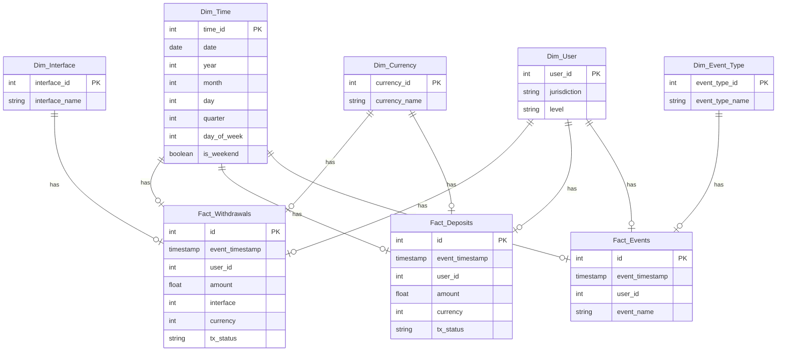
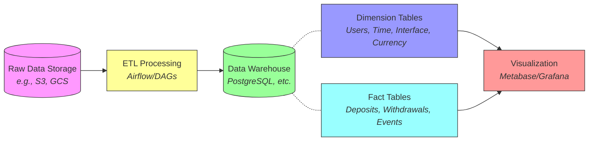
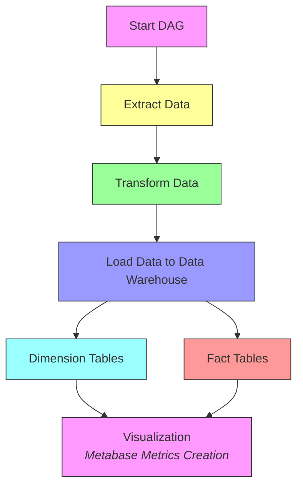

# ETL Pipeline Challenge

This project is an end-to-end ETL pipeline built with Docker, PostgreSQL, Airflow, and Metabase. The pipeline performs daily data ingestion and transformation, stores the data in PostgreSQL, and provides visualizations and metrics in Metabase.

## Project Structure

```plaintext
.
├── dags/                   # Airflow DAGs
│   └── etl_dag.py          # Main ETL DAG definition
├── db/                     # PostgreSQL Docker setup
│   └── Dockerfile          # PostgreSQL Dockerfile
├── etl/                    # ETL scripts and configuration
│   ├── config/             # Configuration files
│   │   └── config.yml      # ETL, database and visualization configuration
│   ├── main.py             # Main ETL entry point
│   ├── scripts/            # Data transformation scripts
│   ├── tests/              # Pipeline tests
│   └── utils/              # Utility functions
├── visualization/          # Metabase setup
│   ├── Dockerfile          # Metabase Dockerfile
│   ├── create_metrics.py   # Script to create Metabase charts
│   └── queries.sql         # SQL queries for metrics
├── docker-compose.yml      # Docker Compose configuration
└── README.md               # Project README
```

## Features

- **ETL Pipeline**: Extracts, transforms, and loads data from CSV files into a PostgreSQL database (can also be loaded in a CSV file).
- **Data Orchestration**: Uses Apache Airflow for scheduling and orchestrating daily ETL task.
- **Data Storage**: Data is stored in a PostgreSQL database (example of processed tables can also be accessed in CSV files at `etl/data/processed`)
- **Data Visualization**: Metabase provides an interface for creating dashboards and visualizing metrics (run `create_metrics.py` to create metrics automatically).
- **Dockerized Deployment**: All services run in Docker containers, making deployment simple and consistent.

---

## Star Schema Data Model

This project follows a star schema design to structure the data in a way that optimizes query performance and provides a clear structure for reporting and analytics.

### Fact Tables

- **Fact_Withdrawals**:
  - **Metrics**: Transaction amount, transaction count.
  - **Dimensions**: Timestamp, user, interface, currency, transaction status.

- **Fact_Events**:
  - **Metrics**: Event count.
  - **Dimensions**: Timestamp, user, event type.

- **Fact_Deposits**:
  - **Metrics**: Deposit amount, deposit count.
  - **Dimensions**: Timestamp, user, currency, transaction status.

### Dimension Tables

- **Dim_User**: Contains user attributes such as `user_id`, `jurisdiction` and `level`.
- **Dim_Time**: Holds time-based attributes, making it easier to aggregate data by day, week, month, etc.
- **Dim_Interface**: Represents the interface used for the transaction (e.g., app, web).
- **Dim_Currency**: Contains information about currencies used in the transactions (e.g., MXN, USD).
- **Dim_Event_Type**: Represents different types of events (e.g., login, level_change_up).

### Star Schema Diagram

Below is a diagram illustrating the relationships between fact and dimension tables in the star schema:



### Checking schema output
- Run docker and check PostgreSQL database tables
- Or check at `etl/data/processed` the output CSV files


---

## Proposed Data Architecture




---

### ETL DAG Workflow



---

## Project Prerequisites

- [Docker](https://www.docker.com/)
- [Docker Compose](https://docs.docker.com/compose/) 
- Python 3.x
- Git

## Getting Started

1. **Clone the repository:**

   ```bash
   git clone git@github.com:joaomarcoscmaciel/etl_challenge.git
   cd etl_pipeline_project
   ```

2. **Environment Setup:**

   Update `config.yml` with database and Metabase credentials as needed.

3. **Build and Run Containers:**

   ```bash
   docker-compose up --build
   ```

   This will build and start the PostgreSQL, Airflow, and Metabase services.

4. **Access Services:**

   - **Airflow**: http://localhost:8080 (Default credentials: `admin` / `admin`)
   - **Metabase**: http://localhost:3000 (Configure upon first login and use them in config.yml)

## Usage

### Running the ETL Pipeline

The ETL pipeline is orchestrated by an Airflow DAG (`etl_dag.py`). By default, it will run daily and load new data into the PostgreSQL database. You can trigger the DAG manually from the Airflow UI:

1. Access the Airflow UI at http://localhost:8080.
2. Enable and trigger the `etl_incremental_dag`.

### Executing Locally

To run the ETL pipeline locally without Docker, follow these steps:

1. **Create a virtual environment**:
   ```bash
   python3 -m venv venv
   source venv/bin/activate  # On Windows, use venv\Scripts\activate
   ```

2. **Install the requirements**:
   ```bash
   pip install -r requirements.txt
   ```

3. **Execute `main.py`**:
   ```bash
   python etl/main.py
   ```

4. **Check logs if needed**:
   Logs are automatically generated to monitor ETL progress and potential issues. Check the `logs/` directory for details.

### Executing Tests

To run validation and data quality tests, follow these steps:

1. **Activate the virtual environment**:
   ```bash
   source venv/bin/activate  # On Windows, use venv\Scripts\activate
   ```

2. **Run the tests**:
   ```bash
   python tests/pipeline_tests.py
   ```

   Here, you’ll see the following checks running:

   - **Test 1**: Schema Validation
   - **Test 2**: Null Value Checks
   - **Test 3**: Duplicate Checks
   - **Test 4**: Consistency Checks (User IDs, Event Types, Currency)
   - **Test 5**: Range Checks for Amount
   - **Test 6**: Data Type Validation
   - **Test 7**: Date Consistency Checks

### Creating Visualizations on Metabase

To set up Metabase visualizations, follow these steps:

1. **Ensure `config.yml` is updated**:
   Update any necessary Metabase credentials or settings in the `config/config.yml` file.

2. **Run the metrics creation script**:
   ```bash
   python visualization/create_metrics.py
   ```

3. **Access Metabase to view charts**:
   Open Metabase in your browser at [http://localhost:3000](http://localhost:3000), then login to see the following metrics:

   - Active Users Per Day
   - Users Without Deposit
   - Users With More Than 5 Deposits
   - Last Login Per User
   - Logins Between Dates
   - Unique Currencies Deposited Per Day
   - Unique Currencies Withdrew Per Day
   - Total Amount Deposited Per Currency Per Day

### Customizing the Queries

The SQL queries used for generating metrics are in `visualization/queries.sql`. You can modify these queries and add new ones as needed. Use the Metabase script to automate metric creation if needed.

## Troubleshooting

- **Airflow Not Showing DAG**: Ensure your DAG file is in the `dags/` folder and is correctly formatted.
- **Metabase Connection Issues**: Double-check the database host in `config.yml` and ensure that Metabase is configured to connect to the correct database container.